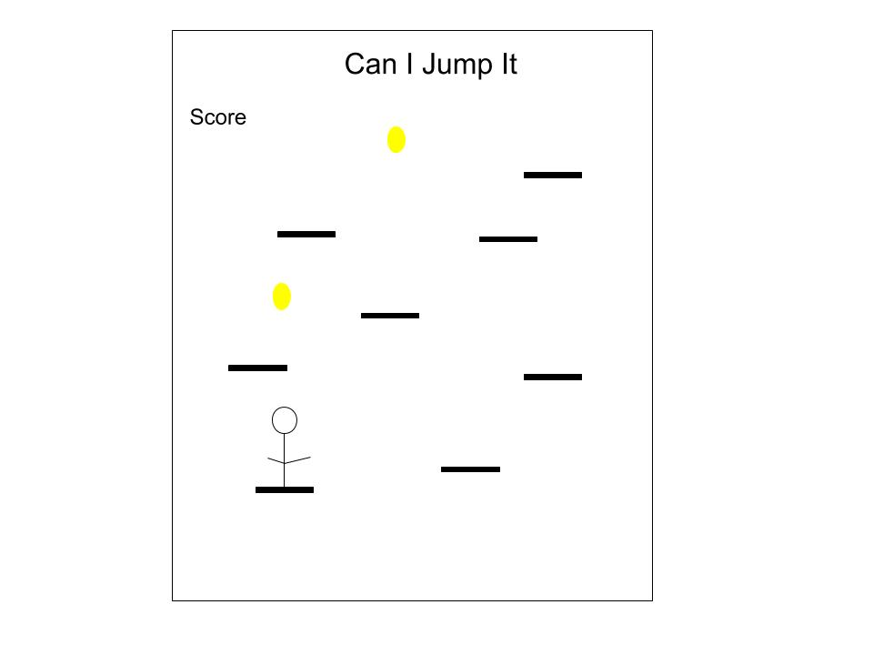

# Can I Jump It

Can I Jump It is a JavaScript game inspired by the browser game [doodle Jump](http://www.agame.com/game/doodle-jump). The objective of Can I Jump It is to vertically move up the game board by landing on platforms. When the character lands on a platform it will automatically jump up. Players accumulate points by moving up and by collecting tokens. The game only ends when a player unsuccessfully jumps on a platform and falls off the board.  

## Functionality & MVP

* Board goes on forever
* Character jumps after landing on platform
* Points are tallied as character moves up board.
* Music can be turned on and off.
* First page is a menu with directions.

## Wireframes

## Technologies

* JavaScript
* Canvas
* HTML
* CSS

## Timeline

### Day 1

* Project setup
* Create game board physics
* Create character

### Day 2

* Token creation
* Platform creation and platform physics
* Board Score

### Day 3

* Game instructions
* End game logic

## Bonus Features

* Leaderboard that keeps track of all time best scores.
* Different color platforms move the character different distances.
* Character has to dodge enemies while jumping.
